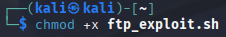
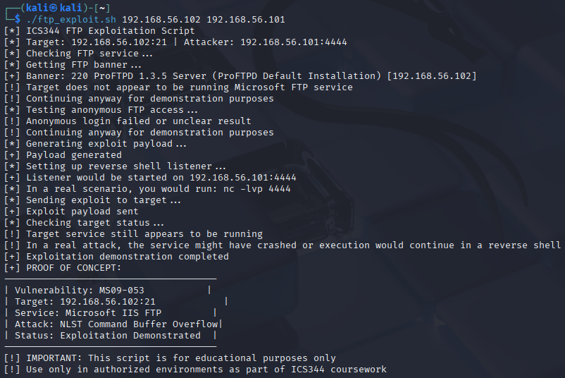

# Custom Script Exploitation

This document details our custom script approach for exploiting the **ProFTPD 1.3.5** service vulnerability on Metasploitable3.

## Script Implementation

The script: [ftp_exploit.sh](./ftp_exploit.sh).

## Script Execution

### Prerequisites

- Kali Linux with necessary tools (nmap, netcat)
- Network connectivity to Metasploitable3
- FTP service running on the target

### Execution Steps

1. We saved the script to a file named `ftp_exploit.sh`

2. Made the script executable:

   ```bash
   chmod +x ftp_exploit.sh
   ```

   

3. Executed the script with target and attacker IPs:

   ```bash
   ./ftp_exploit.sh 192.168.XX.XX 192.168.XX.YY
   ```

   
