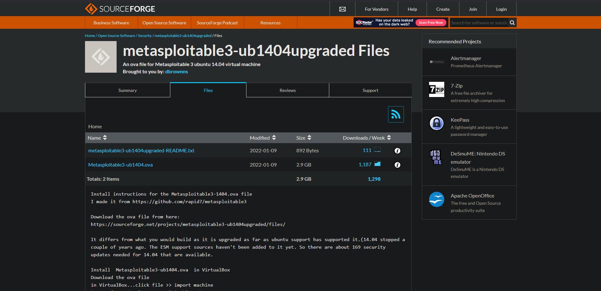
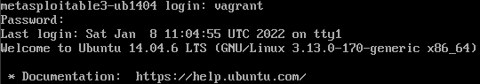
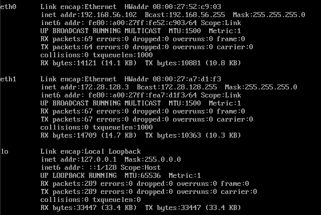
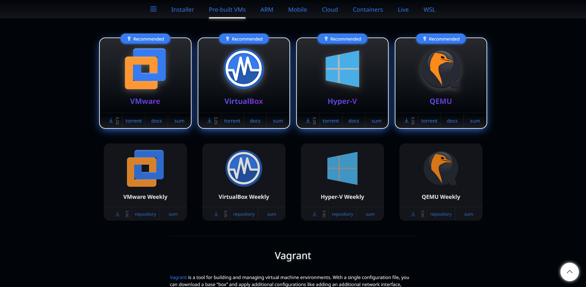
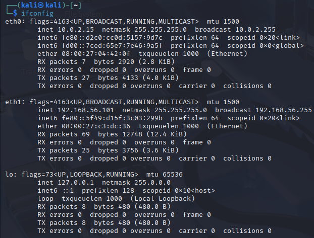
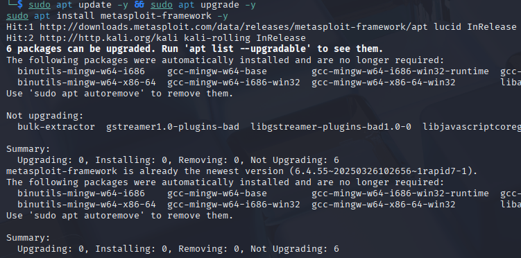
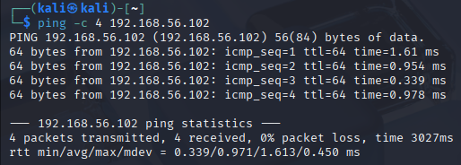
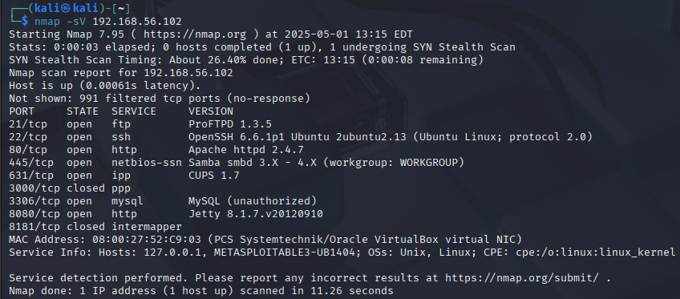
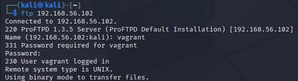

# Environment Setup Documentation

## Victim Environment: Metasploitable3

### Installation Steps

1. **Downloaded Metasploitable3 OVA**
   - Downloaded the pre-built Metasploitable3 OVA file from: <https://sourceforge.net/projects/metasploitable3-ub1404upgraded/files/>

   

2. **Imported OVA into VirtualBox**
   - Clicked File → Import Appliance
   - Selected the downloaded OVA file

    

3. **Configured VM Settings**
   - RAM: 2GB
   - CPU: 2 cores
   - Network: Bridged Adapter (to allow communication between VMs)

    

4. **Started the Metasploitable3 VM**
   - Logged in with default credentials:
     - Username: `vagrant`
     - Password: `vagrant`

   

5. **Network Configuration**
   - Identified IP address using `ifconfig`

   

6. **Verified Running Services**
   - Used `netstat -tuln` to check running services
   - Confirmed FTP service running on port 21

   

## Attacker Environment: Kali Linux

1. **Downloaded Kali Linux**
   - Downloaded Kali Linux VirtualBox image from official website

   

2. **Imported and Configured Kali Linux**
   - Imported the VDI file into VirtualBox
   - Configured with 4GB RAM and 2 CPU cores
   - Set network to Host-only Adapter (same as Metasploitable3)

   

3. **Started Kali Linux**
   - Default credentials:
     - Username: `kali`
     - Password: `kali`

   

4. **Network Configuration**
   - Identified IP address using `ifconfig`

   

5. **Installed Metasploit Framework**
   - Updated system: `sudo apt update && sudo apt upgrade -y`
   - Installed Metasploit: `sudo apt install metasploit-framework -y`

   

6. **Connectivity Test**
   - Pinged Metasploitable3 from Kali: `ping 192.168.56.102`
   - Confirmed connectivity between machines

   

## Service Identification

1. **Port Scanning**
   - Ran Nmap scan: `nmap -sV 192.168.56.102`
   - Identified ProFTPD service running on port 21

   

2. **Service Enumeration**
   - Connected to FTP service: `ftp 192.168.56.102`
   - Identified banner information showing ProFTPD 1.3.5
   - Attempted anonymous login

   

## Environment Verification

- Both VMs are properly configured and can communicate with each other
- Target service (ProFTPD 1.3.5) is accessible from the attacker machine
- All tools required for the attack are installed and working correctly
