# Phase 2: Visual Analysis with Splunk SIEM Dashboard

## SIEM Setup and Log Integration

We established a comprehensive security monitoring infrastructure by integrating logs from both victim and attacker environments into Splunk SIEM.

### 1. Log Collection Strategy

#### 1.1 Victim Environment Logs
We collected the following critical system and application logs from the victim's machine:
- `/var/log/syslog` - General system logs
- `/var/log/auth.log` - Authentication and authorization logs
- `/var/log/apache2/access.log` - Web server access records
- `/var/log/apache2/error.log` - Web server error events

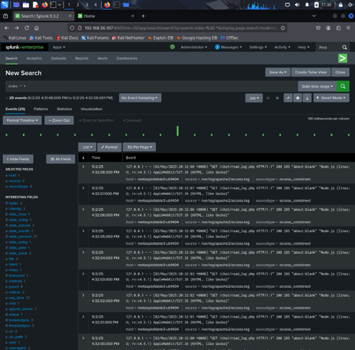
Victim logs integration into Splunk

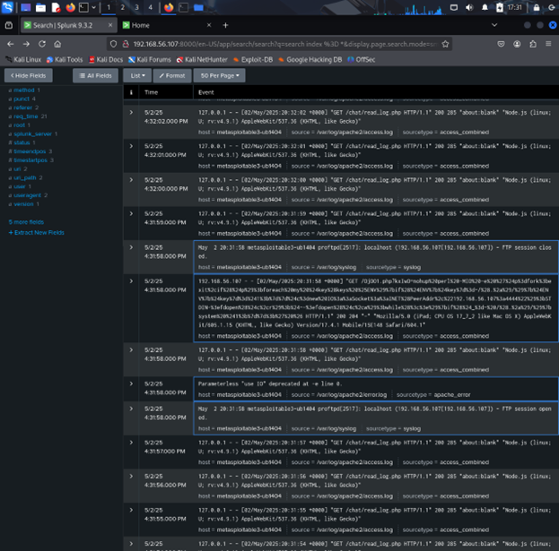
Highlighted box indicating FTP attack events

#### 1.2 Attacker Environment Logs
From the attacker's machine, we collected:
- `framework.log` - Contains detailed records of attack execution and progression

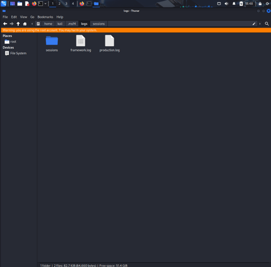
Logs inside attacker's machine

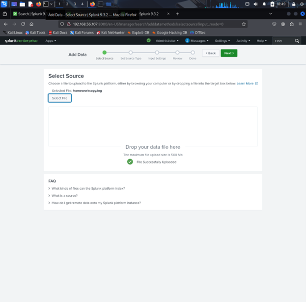
Adding framework.log into Splunk

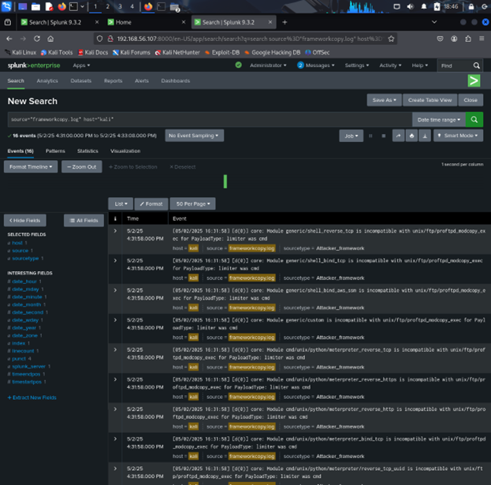
Integration of attacker's logs into Splunk

### 2. Network Traffic Capture

To provide additional context, we implemented real-time network monitoring between the attacker and the victim:

```bash
sudo tcpdump -i eth0 -l port 21 or port 80 > attack.log
```

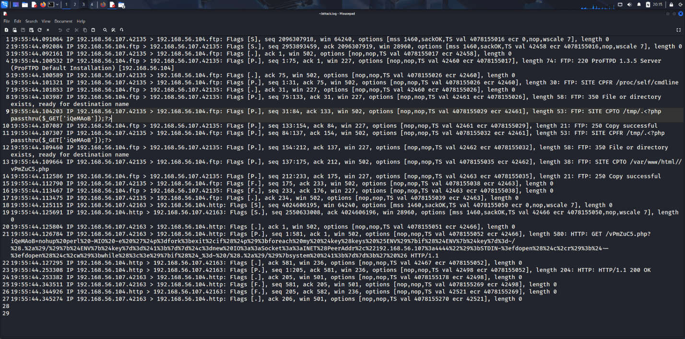
Attack.log created using tcpdump

This command specifically targeted FTP (port 21) and HTTP (port 80) traffic, capturing the attack sequence at the network level.

## Log Visualization and Attack Analysis


### 1. Victim Machine Log Analysis

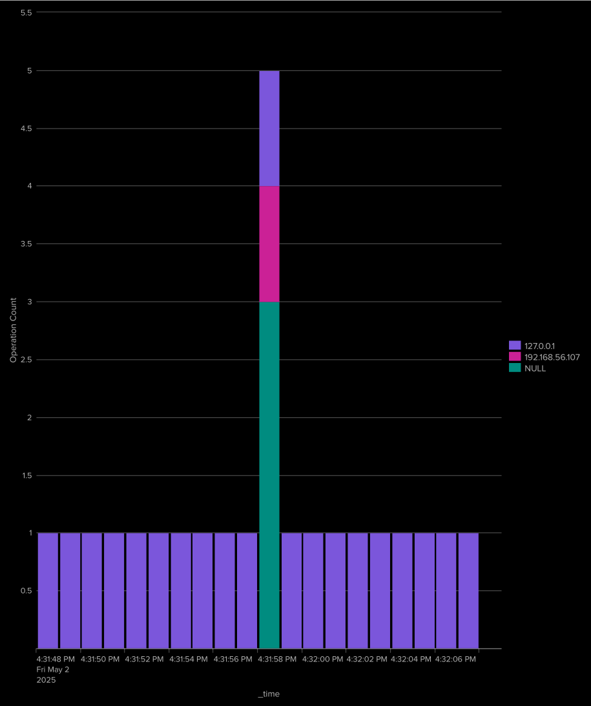
Events Count vs Time gathered from victim's machine

The visualization reveals a sudden increase of 4 events  at the moment of attack initiation. This is a clear indicator of compromise.

### 2. Attacker Framework Log Analysis

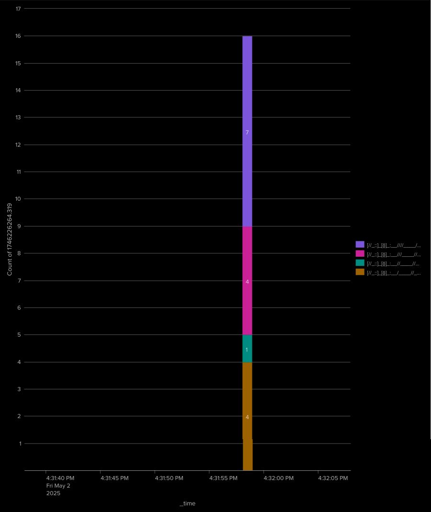
Sudden spike in log events within a short timeframe from attacker's machine

The framework.log data visualization shows a concentrated burst of log events within an narrow timeframe. This pattern is typical of automated attack tools.

### 3. Network Traffic Pattern Analysis

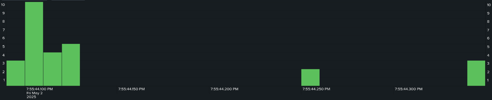
Activity captured from FTP and HTTP traffic in attack.log

Using Splunk's field extraction capabilities, we decomposed the network traffic to identify protocol-specific patterns:

#### 3.1 Protocol Distribution

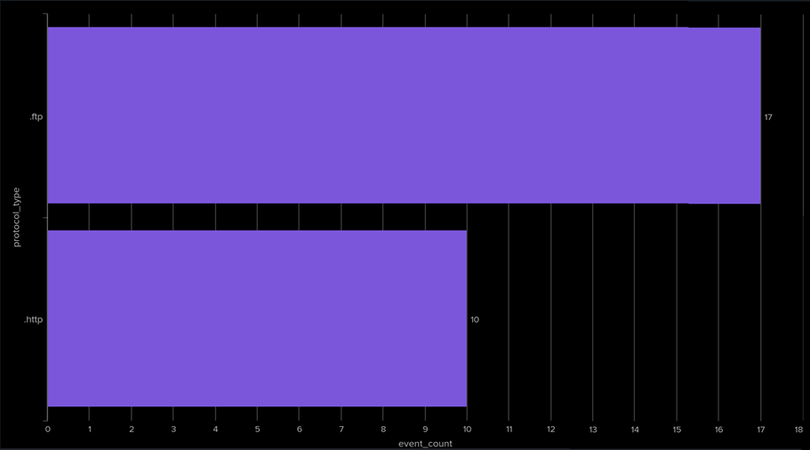

We categorized all captured traffic by protocol type, revealing the attacker's focus on FTP services as the primary attack vector, with supplementary HTTP activity.

#### 3.2 FTP Command Sequence Analysis

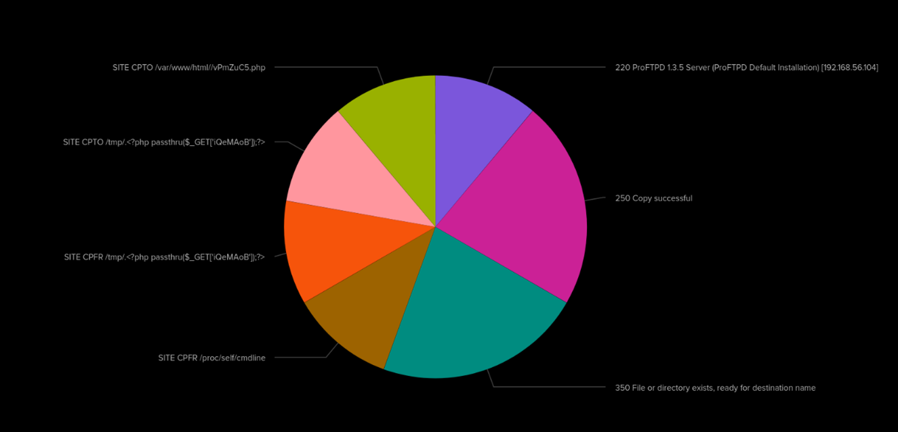

Further examination of FTP events revealed the specific command sequence used in the attack:

| FTP Command/Response | Count | Significance |
|----------------------|-------|-------------|
| 250 Copy | 2 | Successful file transfer operations |
| 350 File/Directory Exists | 2 | Pre-execution checks |
| SITE CPTO | 2 | Server-side file operations |
| SITE CPFR | 2 | File reference commands |
| 220 ProFTPD | 1 | Initial connection to FTP service |

This sequence analysis provides clear evidence of unauthorized file manipulation operations targeting the ProFTPD service.

